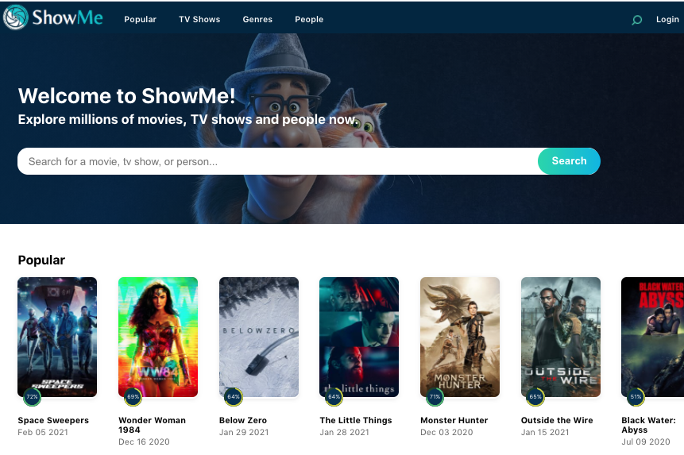

# ShowMe - Movies and TV shows


An open source project that is for all movie and TV show lovers. Here you will be able to find information about movies, TV shows and your favorite actors, read reviews, watch trailers and many more...



## Table of contents

- [General info](#general-info)
- [Technologies](#technologies)
- [Setup](#setup)
- [Sources](#sources)
- [Contacts](#contacts)

## General info

This project was created for Web Development Course in Digital Career Institute. It is a single page application using react.

## Technologies

It was built with:

- `create-react-app`
- `react-route-dom`
- `redux`
- `styled-components`
- `firebase`

## 🚀 Installation

1. Clone the repo:

   ```sh
   git clone https://github.com/AdrianValdes/all-movies.git
   ```

2. Install NPM packages:

   ```sh
   npm install
   ```

3. Get a free API Key from the project The Movie Database [here](https://developers.themoviedb.org)

4. Get a free Firebase API Key. In order to accomplish this task you have to create an firebase account on https://firebase.google.com/ and add a new project or use a existing API you already may have.

5. Create a `.env` file on the root of your project and enter both you APIs keys there:

   ```sh
   REACT_APP_KEY=<THEMOVIEDB-API-KEY>
   REACT_APP_FIREBASE_KEY=<FIREBASE-API-KEY>
   ```

6. run `npm start`

## Sources

This project is based on The Movie Database and its [API](https://developers.themoviedb.org/3).

## Contacts

- Adrian Valdes -https://github.com/AdrianValdes
- Joyce Sosaya -https://github.com/Winkel2019
